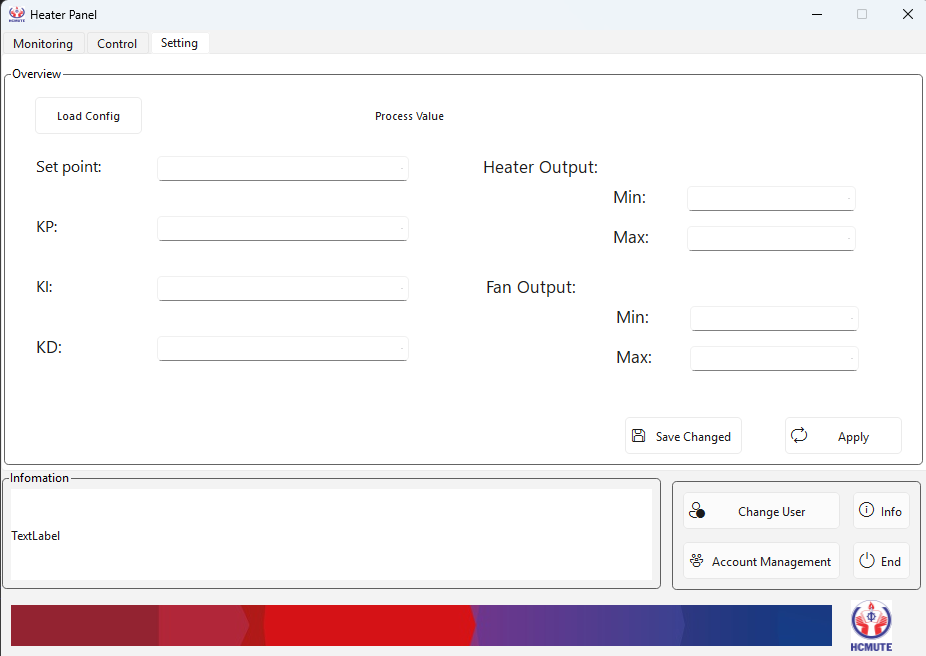

# control_heater

## Overview

This application provides a GUI to monitor and control the input and output states Heater system. It includes features such as real-time input monitoring, output control, and user authentication for access control.

